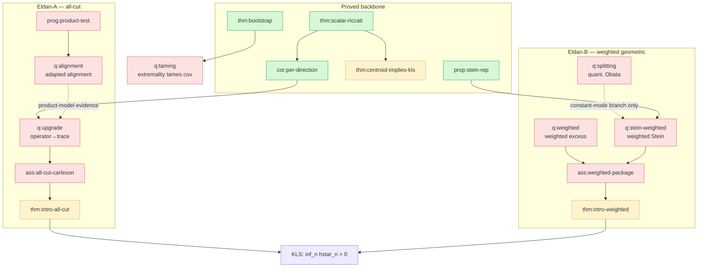

# Roadmap — Eldan fixed-cut conditional program

The narrative map of the program. For the machine-readable logical state see
[`../../ledger.yaml`](../../ledger.yaml); for the no-go results see
[`../../obstructions.md`](../../obstructions.md);
for dispatchable work items see [`open-problems.md`](open-problems.md). Ported from the
standalone KLS program's roadmap (references by stable `\label`/node id, which survive the
unified-module renumbering).

## The one-line strategy

Follow the posterior evolution of a **fixed candidate cut** `E` under Eldan stochastic
localization. The mass `p_t = μ_t(E)` is a martingale; KLS follows if a balanced cut
**cannot be identified too fast** by the early Gaussian observation. Everything reduces to
keeping `p_t` in a balanced window for a universal time. Proof posture throughout: **by
contradiction against a near-worst measure** `h_μ ≤ (1+ε) hstar_n` — this is what makes the
bootstrap anchor (`thm:bootstrap`) legitimate.

## The legacy proved backbone (unconditional statements; R2 debt recorded)

The inline arguments below predate the current standalone-dossier and independent-review
contract. Their ledger statuses are preserved, but the August 24 audit records the certification
debt; this heading is not a fresh R2 review.

```
mass martingale  d[p]_t = s_t r_t dt           (eq:qv-p)
        │
        ▼
stopped centroid estimate  ⇒  KLS              (thm:centroid-implies-kls, needs ass:stopped-centroid)
        ▲
        │ Gronwall on E r_{t∧τ}
two-color Riccati:  dr = dM + (S − D)dt         (thm:scalar-riccati)
   • only positive source  S = s‖G‖²
   • damping coercive       D ≥ r²
        │
        ▼
per-direction Carleson  E ∫ s|Gθ|² ≤ 1          (cor:per-direction)   ← dimension-free, quadratic-form level
        │
        ▼
   MISSING: operator-to-trace upgrade           (q:upgrade)           ← the essential gap of Eldan-A
```

The Riccati identities, the per-direction estimate, the Stein representation
(`prop:stein-rep`), the bootstrap comparison theorem (`thm:bootstrap`), the perimeter
martingale and excess identity, and the product coordinate-budget theorem (`thm:budget`) are
all **proved**. The conjecture sits behind two **conditional** headline implications and
their open inputs.

## The two Eldan subroutes

**Eldan-A — all-cut stochastic.** Prove `ass:all-cut-carleson` (the absorptive two-color
Carleson estimate for every balanced cut). By `thm:intro-all-cut` this alone implies KLS. The
gap is the **operator-to-trace upgrade** `q:upgrade`: lift `cor:per-direction` from
per-direction (quadratic-form) to trace scale, uniformly over cuts. Bounded by
`obs:proj-ceiling` (projection tests cap at log n) and `obs:two-tail`. First decision point:
the **product stress test** (`prog:product-test`, executed in
`modules/kls/09-product-stress.tex`), which has refuted the rank-one counterexample
(`obs:rank-one-refuted`) and reduced the remaining danger to the **adapted alignment problem**
`q:alignment`. The designated Laplace tail-union computation has now been executed through
$n=1024$: it detects a finite-dimensional alignment pulse but no divergence, so the mathematical
node remains open and the artifact carries no route verdict.

**Eldan-B — near-Cheeger geometric (weighted).** Work only with near-minimizers. Needs two
weighted inputs (`ass:weighted-package`):
- (i-w) **weighted excess propagation** `q:weighted`, and
- (ii-w) **weighted stable Stein trace** `q:stein-weighted`.

By `thm:intro-weighted` these imply KLS. The consolidation's main clarification (the
**consumption audit** `prop:intro-audit`): the *unweighted* excess term is **inert**
(unconditionally `O(T)` by `prop:trivial-excess`), so the unweighted Stein estimate silently
carried the whole route — and by `obs:two-tail` it has **no slice-wise proof**. Within this
particular slice-wise package with a pure covariance power multiplying absolute excess,
`(1+‖A‖)^{5/2}` is the least statically compatible exponent. This is not a route-agnostic
necessity.

## How the excess-propagation question was audited

1. **Audit** (`prop:intro-audit`): unweighted excess is inert.
2. **Obstruction** (`obs:two-tail`): no unweighted slice-wise absolute-scale proof; exponent
   $5/2$ is calibrated for this package.
3. **Circularity warning** (`obs:circularity`): directly inserting a lower bound for the random
   localized profile may restate KLS. The moving balanced competitor family is not covered by
   the fixed-family supermartingale lemma, so this is not a formal no-go.
4. **Bootstrap** (`thm:bootstrap`): anchoring at `hstar_n` supplies a non-circular comparison
   for near-worst measures and compresses everything into the scalar interface `h_μ Ξ_T`,
   `Ξ_T = ∫_0^T E (λmax(A_t) − 1)_+ dt`.

Interface evaluation: crude `Ξ_T ≲ log n` is **provably insufficient**
(`obs:crude-insufficient`); polylog technology gives `Ξ_T ≲ loglog n` (`cor:loglog`, via
`hyp:KI`, discharged on the published `c/log² n` window and, conditional on Letwin v1, on the
larger `c/log n` fixed-time moment window); demanding `Ξ_T ≤ κT` for *all* measures at a
sufficiently small universal time is already **KLS-sufficient** (`obs:relative-ceiling`). The residual is `q:taming`: does *extremality
itself* tame the covariance process?

## Dependency graph (headline nodes)



Legend: green = proved, yellow = conditional, red = open. Solid arrows are logical/dispatch
edges; dashed arrows are heuristic or partial contributions, not theorem implications.
(Obstruction edges omitted; see [`../../ledger.yaml`](../../ledger.yaml) `bounded_by` and
[`../../obstructions.md`](../../obstructions.md).)

## Status snapshot

| Component | Route | Status | Node |
|---|---|---|---|
| Mass martingale + centroid reduction | both | proved survival lemma; conditional centroid implication | `lem:survival-implies-kls`, `thm:centroid-implies-kls` |
| Two-color Riccati identities | both | proved | `thm:scalar-riccati`, `lem:matrix-riccati` |
| Per-direction Carleson | A | proved | `cor:per-direction` |
| Intrinsic quadratic-chaos bound | both | imported (Letwin v1) | `thm:letwin-qcts` |
| Operator-to-trace upgrade | A | **open** | `q:upgrade` |
| Product coordinate budgets; rank-one refuted | A | proved | `thm:budget`, `cor:refutation` |
| Adapted alignment problem | A | **open**; designated tail-union diagnostic non-refuting | `q:alignment` |
| Consumption audit; two-tail obstruction | B | proved | `prop:intro-audit`, `prop:two-tail` |
| Bootstrap comparison + published interface evaluation | B | proved | `thm:bootstrap`, `cor:loglog`, `cor:KI-discharged` |
| Weighted excess propagation | B | **open** | `q:weighted` |
| Weighted stable Stein trace | B | **open** | `q:stein-weighted` |
| Quantitative splitting / Obata | B | **open** | `q:splitting` |
| Extremality tames covariance | B | **open** | `q:taming` |

## What "done" looks like

- **Eldan-A done** = `q:upgrade` proved ⇒ `ass:all-cut-carleson` ⇒ KLS.
- **Eldan-B done** = `q:weighted` + `q:stein-weighted` proved ⇒ `ass:weighted-package` ⇒ KLS.
- **Intermediate prize** (`cor:dichotomy`): under the separate
  `hyp:absolute-geometric-completion`, an absolute-scale completion with small constant yields
  `hstar_n ≥ c/loglog n`, improving even the Letwin-v1 `log^{-1/4} n` scale, with full KLS
  requiring `q:taming` at the completion's time (or a completion uniform in that supplied time).
