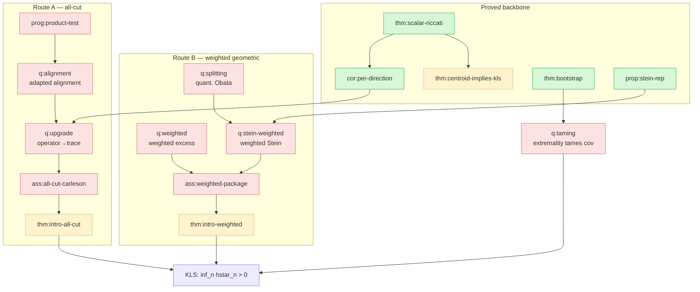

# Roadmap — KLS conditional proof program

The narrative map of the program. For the machine-readable logical state see
[`ledger.yaml`](ledger.yaml); for the no-go results see [`obstructions.md`](obstructions.md);
for dispatchable work items see [`open-problems.md`](open-problems.md). Ported from the
standalone KLS program's roadmap (references by stable `\label`/node id, which survive the
unified-module renumbering).

## The one-line strategy

Follow the posterior evolution of a **fixed candidate cut** `E` under Eldan stochastic
localization. The mass `p_t = μ_t(E)` is a martingale; KLS follows if a balanced cut
**cannot be identified too fast** by the early Gaussian observation. Everything reduces to
keeping `p_t` in a balanced window for a universal time. Proof posture throughout: **by
contradiction against a near-worst measure** `h_μ ≤ (1+ε) hstar_n` — this is what makes the
bootstrap anchor (`thm:bootstrap`) legitimate.

## The proved backbone (unconditional)

```
mass martingale  d[p]_t = s_t r_t dt           (eq:qv-p)
        │
        ▼
stopped centroid estimate  ⇒  KLS              (thm:centroid-implies-kls, needs ass:stopped-centroid)
        ▲
        │ Gronwall on E r_{t∧τ}
two-color Riccati:  dr = dM + (S − D)dt         (thm:scalar-riccati)
   • only positive source  S = s‖G‖²
   • damping coercive       D ≥ r²
        │
        ▼
per-direction Carleson  E ∫ s|Gθ|² ≤ 1          (cor:per-direction)   ← dimension-free, quadratic-form level
        │
        ▼
   MISSING: operator-to-trace upgrade           (q:upgrade)           ← the essential gap of Route A
```

The Riccati identities, the per-direction estimate, the Stein representation
(`prop:stein-rep`), the bootstrap comparison theorem (`thm:bootstrap`), the perimeter
martingale and excess identity, and the product coordinate-budget theorem (`thm:budget`) are
all **proved**. The conjecture sits behind two **conditional** headline implications and
their open inputs.

## The two routes

**Route A — all-cut stochastic.** Prove `ass:all-cut-carleson` (the absorptive two-color
Carleson estimate for every balanced cut). By `thm:intro-all-cut` this alone implies KLS. The
gap is the **operator-to-trace upgrade** `q:upgrade`: lift `cor:per-direction` from
per-direction (quadratic-form) to trace scale, uniformly over cuts. Bounded by
`obs:proj-ceiling` (projection tests cap at log n) and `obs:two-tail`. First decision point:
the **product stress test** (`prog:product-test`, executed in
`modules/kls/09-product-stress.tex`), which has refuted the rank-one counterexample
(`obs:rank-one-refuted`) and reduced the remaining danger to the **adapted alignment problem**
`q:alignment`.

**Route B — near-Cheeger geometric (weighted).** Work only with near-minimizers. Needs two
weighted inputs (`ass:weighted-package`):
- (i-w) **weighted excess propagation** `q:weighted`, and
- (ii-w) **weighted stable Stein trace** `q:stein-weighted`.

By `thm:intro-weighted` these imply KLS. The consolidation's main clarification (the
**consumption audit** `prop:intro-audit`): the *unweighted* excess term is **inert**
(unconditionally `O(T)` by `prop:trivial-excess`), so the unweighted Stein estimate silently
carried the whole route — and by `obs:two-tail` it has **no slice-wise proof**. The weight
`(1+‖A‖)^{5/2}` is *forced*, not chosen.

## How the excess-propagation question was resolved

1. **Audit** (`prop:intro-audit`): unweighted excess is inert.
2. **Obstruction** (`obs:two-tail`): no slice-wise absolute-scale proof; weight forced.
3. **Circularity** (`obs:circularity`): direct propagation = a localized KLS statement; needs
   an external anchor.
4. **Bootstrap** (`thm:bootstrap`): anchoring at `hstar_n` breaks the circularity for
   near-worst measures and compresses everything into the scalar interface `h_μ Ξ_T`,
   `Ξ_T = ∫_0^T E (λmax(A_t) − 1)_+ dt`.

Interface evaluation: crude `Ξ_T ≲ log n` is **provably insufficient**
(`obs:crude-insufficient`); polylog technology gives `Ξ_T ≲ loglog n` (`cor:loglog`, via
`hyp:KI`, now discharged by `thm:KL-window`); demanding `Ξ_T ≤ κT` for *all* measures is
**KLS-equivalent** (`obs:relative-ceiling`). The residual is `q:taming`: does *extremality
itself* tame the covariance process?

## Dependency graph (headline nodes)



Legend: green = proved, yellow = conditional, red = open. Edges point from input to what it
unlocks. (Obstruction edges omitted; see `ledger.yaml` `bounded_by` and `obstructions.md`.)

## Status snapshot

| Component | Route | Status | Node |
|---|---|---|---|
| Mass martingale + centroid reduction | both | proved | `thm:centroid-implies-kls` (cond. on `ass:stopped-centroid`) |
| Two-color Riccati identities | both | proved | `thm:scalar-riccati`, `lem:matrix-riccati` |
| Per-direction Carleson | A | proved | `cor:per-direction` |
| Operator-to-trace upgrade | A | **open** | `q:upgrade` |
| Product coordinate budgets; rank-one refuted | A | proved | `thm:budget`, `cor:refutation` |
| Adapted alignment problem | A | **open** | `q:alignment` |
| Consumption audit; two-tail obstruction | B | proved | `prop:intro-audit`, `prop:two-tail` |
| Bootstrap comparison + interface | B | proved | `thm:bootstrap`, `cor:loglog` |
| Weighted excess propagation | B | **open** | `q:weighted` |
| Weighted stable Stein trace | B | **open** | `q:stein-weighted` |
| Quantitative splitting / Obata | B | **open** | `q:splitting` |
| Extremality tames covariance | B | **open** | `q:taming` |

## What "done" looks like

- **Route A done** = `q:upgrade` proved ⇒ `ass:all-cut-carleson` ⇒ KLS.
- **Route B done** = `q:weighted` + `q:stein-weighted` proved ⇒ `ass:weighted-package` ⇒ KLS.
- **Intermediate prize** (`cor:dichotomy`): completing Route B at absolute scale with small
  constant already yields `hstar_n ≥ c/loglog n` — an exponential improvement on the best
  known bound — with full KLS following from `q:taming`.
```
